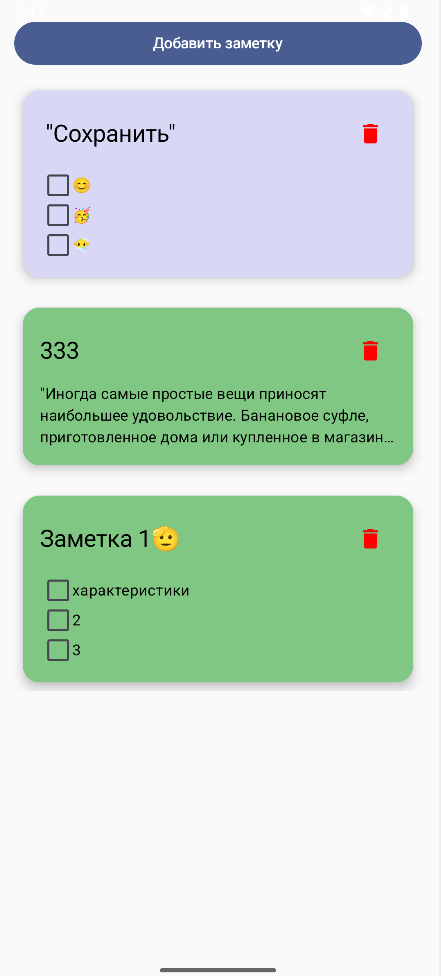
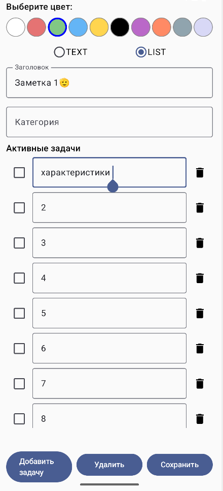

 📝 ToDo List / Notes App

Многофункциональное Android-приложение для создания текстовых заметок и списков задач.

 🚀 Возможности
- Создание заметок двух типов: текст и список задач
- Цветовая кастомизация заметок
- Удаление, редактирование и сохранение
- Группировка задач на активные и завершённые
- Поддержка категорий заметок
- Современный дизайн с Jetpack Compose

📸 Скриншоты

Главный экран


 Редактирование заметки


Сборка и запуск

1. Клонируйте репозиторий:
   ```bash
   git clone https://github.com/jxmcool/ToDoList.git
2.Откройте в Android Studio

3.Запустите MainActivity


Стек технологий
Язык: Kotlin

UI: Jetpack Compose

Хранение данных: SharedPreferences

Особенности:

Без ViewModel

Без базы данных

Минималистичная архитектура с сохранением данных в памяти


